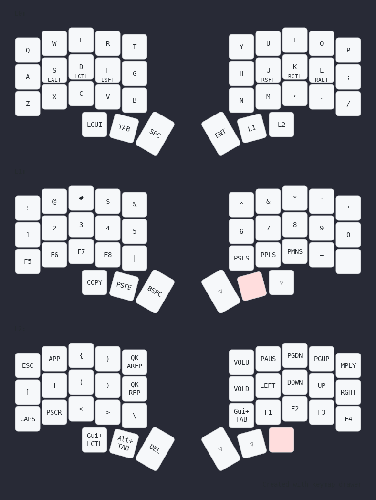

# My keyboard config

[For the chocofi keyboard](https://github.com/pashutk/chocofi)

## Compilation:
- make sure qmk is ready `qmk setup`
- create a symbolic link from this repo to qmk_firmware 
`ln -s ~/aqua_keymap ~/qmk_firmware/keyboards/crkbd/keymaps/aqua_keymap`
- Edit Json with the [online tool](https://config.qmk.fm/#/)
- run `./compile_script.sh aquaX.json`
- install the new uf2 file onto the keyboard `qmk flash aqua_keymap.uf2` 

